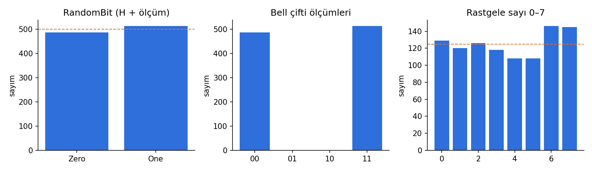
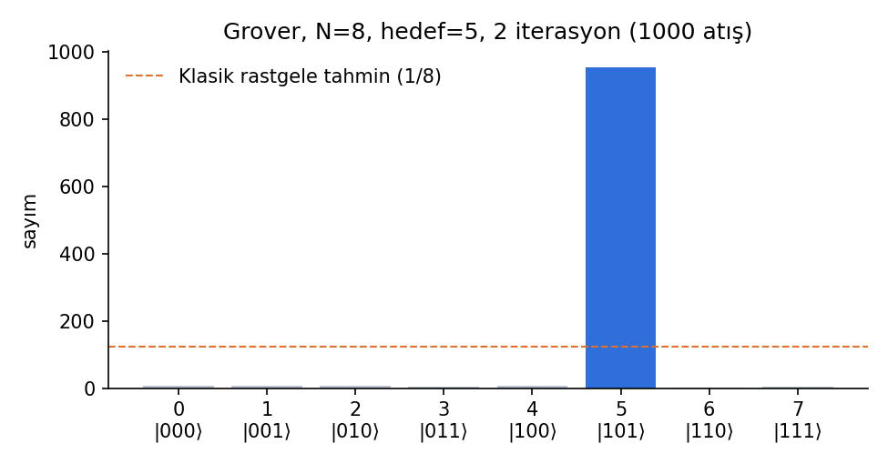
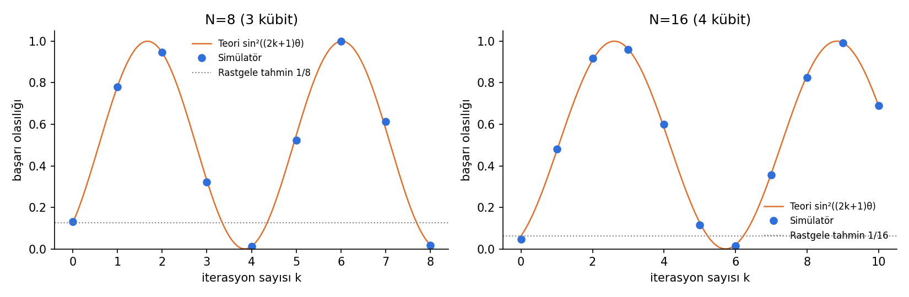

## SUNUM
Sunum Videosu: https://drive.google.com/file/d/1Cuk3B8Yl0lCZOJCzricWDKfYkTRh0RnB/view?usp=sharing

# Q# ile Grover Arama Algoritması

Microsoft Q# ve QDK ile, sadece simülatör kullanarak yapılmış başlangıç seviyesi bir kuantum programlama projesi. 2 ile 6 kübit (4 ile 64 eleman) arasındaki sırasız bir listede işaretli elemanı Grover algoritmasıyla buluyor. Proje, planın üç fazını takip ediyor: temeller, uygulama, test ve dokümantasyon.

---

## 1. Proje özeti

**Problem:** N = 2ⁿ elemanlı sırasız bir listede tek bir "doğru" eleman var. Elimizde sadece bir kara kutu (oracle) var: bir elemana bakınca "bu mu?" sorusuna evet/hayır diyor. Klasik bilgisayar ortalama N/2 sorgu yapmak zorunda. Grover ise yaklaşık (π/4)·√N sorguda yüksek olasılıkla buluyor.

**Neden ilginç:** Algoritma süperpozisyon, faz ve girişim (interference) kavramlarının hepsini birlikte kullanıyor. Ama 2–3 kübitle bile çalışıp anlamlı sonuç veriyor, yani elle takip edilebilecek kadar küçük.

**Kısa sonuç (1000 atış):**

| Kübit | N | Grover oracle çağrısı | Klasik ort. sorgu | Başarı (simülatör) | Teori |
|---|---|---|---|---|---|
| 2 | 4 | 1 | 2.5 | %100 | %100 |
| 3 | 8 | 2 | 4.5 | %94.2 | %94.5 |
| 4 | 16 | 3 | 8.5 | %96.6 | %96.1 |
| 5 | 32 | 4 | 16.5 | %100 | %99.9 |
| 6 | 64 | 6 | 32.5 | %99.9 | %99.7 |

Tüm simülatör sonuçları teorik olasılığa ±%3 içinde uyuyor. Bu fark 1000 atışta beklenen istatistiksel sapma kadar.

---

## 2. Klasör yapısı

```
qsharp-grover/
├── qsharp.json               # Q# proje tanımı
├── src/
│   ├── Basics.qs             # Faz 1: rastgele bit/sayı, H·H, Bell çifti, ışınlama
│   ├── Grover.qs             # Faz 2: oracle, diffusion, iterasyon, arama
│   ├── Main.qs               # @EntryPoint: demo + DumpMachine
│   └── Tests.qs              # Faz 3: 9 adet @Test() birim testi
├── scripts/
│   ├── run_tests.py          # tüm @Test'leri çalıştırır
│   └── run_experiments.py    # istatistik + grafik + CSV üretir
└── results/                  # CSV'ler, PNG grafikler, summary.md
```

## 3. Kurulum ve çalıştırma

```bash
pip install qdk matplotlib          # Q# derleyici + simülatör (Python paketi)

python scripts/run_tests.py         # 9/9 test geçmeli
python scripts/run_experiments.py   # results/ klasörünü yeniden üretir (--shots 5000 vs.)
```

**VS Code ile:** "Azure Quantum Development Kit (QDK)" eklentisini kur ve klasörü aç. `Main.qs` üstündeki **Run** / **Debug** butonuyla çalıştır. `@Test()` işlemleri Test Explorer'da görünür. `DumpMachine()` çıktısı da debug konsolunda çıkar.

Test edilen ortam: `qdk` 1.32.3 (Python 3), yerel sparse-state simülatörü.

---

## 4. Faz 1: Temeller (`Basics.qs`)

Grover'dan önce her kavramı tek başına deneyen küçük programlar:

| İşlem | Ne gösteriyor | Sonuç (1000 atış) |
|---|---|---|
| `RandomBit` | H ile süperpozisyon, ölçüm rastgeleliği | Zero 487, One 513 (±2σ aralığında) |
| `RandomNumberInRange(7)` | Birden fazla kübit/biti sayıya çevirme | 0–7 arası yaklaşık düzgün dağılım |
| `DoubleHadamard` | Girişim: H·H = I | 1000/1000 Zero |
| `BellPair` | Dolanıklık, korele ölçüm | 00: 487, 11: 513, 01/10: **0** |
| `Teleport` | Dolanıklık + klasik iletişimle durum aktarımı | 6 farklı açıda %100 doğru |



**Önemli sezgi:** `DoubleHadamard` Grover'ın anahtarı. Tek H %50/%50 rastgelelik veriyor. İkinci H'de ise |1⟩'e giden iki yolun genlikleri zıt işaretli olduğu için birbirini yok ediyor. Grover da aynı şeyi yapıyor: yanlış cevapların genliklerini girişimle bastırıp doğru cevabınkini büyütüyor.

---

## 5. Faz 2: Tasarım ve uygulama (`Grover.qs`)

### 5.1 Tasarım

```
          ┌──────────── k kez tekrarla ────────────┐
|0…0⟩ → H⊗ⁿ → │ MarkTarget (oracle) → Diffuse (yansıma) │ → ölç → indeks
          └─────────────────────────────────────────┘
```

| Bileşen | Q# işlemi | Görevi |
|---|---|---|
| Başlangıç | `ApplyToEach(H, qs)` | Tüm N indeksin eşit süperpozisyonu \|s⟩ |
| Oracle | `MarkTarget(target, qs)` | \|target⟩'in fazını çevirir (+ → −) |
| Diffusion | `Diffuse(qs)` | Genlikleri ortalama etrafında yansıtır: 2\|s⟩⟨s\| − I |
| İterasyon | `GroverIteration` | Oracle + Diffusion |
| k seçimi | `OptimalIterations(n)` | k = round(π/(4θ) − ½), θ = arcsin(1/√N) |
| Ana algoritma | `GroverSearch(n, target, k)` | Hepsini birleştirip ölçer |

Kübit sayısı n, hedef 0…2ⁿ−1 arası bir tam sayı. Sıralama little-endian, yani `qs[0]` en düşük bit. Yardımcı (ancilla) kübit kullanılmadı, çünkü çok kontrollü Z doğrudan `Controlled Z(Most(qs), Tail(qs))` ile yazılabiliyor.

### 5.2 Oracle nasıl çalışıyor

```qsharp
operation MarkTarget(target : Int, qs : Qubit[]) : Unit is Adj + Ctl {
    let bits = IntAsBoolArray(target, Length(qs));
    within {
        for i in IndexRange(qs) {
            if not bits[i] { X(qs[i]); }   // hedefi |11…1⟩'e dönüştür
        }
    } apply {
        Controlled Z(Most(qs), Tail(qs));  // sadece |11…1⟩'in fazı çevrilir
    }                                      // within bloğu otomatik geri alınır
}
```

`within … apply` yapısı, `within` içindeki adımları `apply`'dan sonra otomatik olarak tersine uyguluyor (uncompute). Bu sayede X'leri geri almayı unutma hatası baştan önleniyor.

### 5.3 Diffusion

Aynı hileyi kullanıyor. `H` ve `X` ile |s⟩'yi |11…1⟩'e taşıyor, orada faz çeviriyor, sonra geri dönüyor. Ortaya çıkan işlem −(2|s⟩⟨s| − I). Başındaki −1 global faz olduğu için ölçümü etkilemiyor.

### 5.4 Durum vektöründe ne oluyor (N=8, hedef=5, 1 iterasyon)

`Main.qs`'teki `DumpMachine()` çıktısı:

```
|101⟩: −0.8839      ← hedef: genlik 0.354'ten 0.884'e çıktı (olasılık %78)
diğer 7 durum: −0.1768 (her biri olasılık %3.1)
```

İkinci iterasyonda hedefin olasılığı %94.5'e çıkıyor.

---

## 6. Faz 3: Test ve sonuçlar

### 6.1 Birim testleri (`Tests.qs`): 9/9 geçti

| Test | Neyi doğruluyor |
|---|---|
| `TestDoubleHadamardIsIdentity` | H·H = I |
| `TestBellPairCorrelated` | Bell ölçümleri her zaman eşit |
| `TestTeleportation` | 6 farklı Ry(θ) durumu kayıpsız ışınlanıyor |
| `TestOracleKeepsBasisState` | Oracle baz durumunu değiştirmiyor (64 kombinasyon) |
| `TestOraclePhaseKickback` | Faz **sadece** hedefte çevriliyor (64 kombinasyon, phase kickback ile) |
| `TestDiffusionFixesUniformState` | Diffusion \|s⟩'yi koruyor |
| `TestReflectionsAreSelfInverse` | Oracle² = I ve Diffusion² = I (`CheckOperationsAreEqual`) |
| `TestGrover2QubitsAlwaysFindsTarget` | N=4'te 4 hedefin hepsi %100 bulunuyor |
| `TestOptimalIterations` | n=2..6 için k = 1, 2, 3, 4, 6 |

**Phase kickback testi:** Faz ölçümle doğrudan görülemiyor. O yüzden |+⟩ durumundaki bir kontrol kübitiyle `Controlled MarkTarget` uygulanıyor. Faz çevrilirse kontrol kübiti |−⟩'ye geçiyor ve H'den sonra ölçüm **deterministik** olarak One veriyor. Böylece olasılıklı bir şeyi kesin bir testle kontrol edebildim.

**Testler gerçekten hata yakalıyor mu?** Oracle'a kasıtlı bir hata eklendi (X'ler yanlış bitlere uygulandı). Bu durumda 9 testten 2'si (`PhaseKickback` ve `Grover2Qubits`) başarısız oldu. Yani testler sadece "her zaman geçen" testler değil.

### 6.2 İstatistiksel testler (`run_experiments.py`)

**N=8, hedef=5, 2 iterasyon:** Başarı %95.4. Teori %94.5, rastgele tahmin ise %12.5.



**İterasyon taraması:** Başarı olasılığı k ile birlikte sin²((2k+1)θ) eğrisini takip ediyor:



### 6.3 Sonuçların yorumu

1. **Grover, rastgele tahminden çok daha iyi.** N=8'de 2 sorguyla %94.5 başarı var. Rastgele tahminde bu oran %12.5, klasik aramada ise ortalama 4.5 sorgu gerekiyor.
2. **Fazla iterasyon zarar veriyor (overshoot).** N=8'de k=2'de %94.5 olan başarı, k=3'te %33'e, k=4'te %1.2'ye düşüyor. Algoritma durumu "hedef yönüne" doğru döndürüyor ve optimum noktayı geçince geri uzaklaşıyor. Grover'ı "ne kadar çok, o kadar iyi" diye çalıştıramazsın. Durma noktasını bilmek gerekiyor.
3. **Periyodiklik.** N=8'de k=6'da başarı tekrar %100'e çıkıyor, çünkü θ = arcsin(1/√8) ve 13θ ≈ 3π/2. Ama 6 iterasyon 2'nin üç katı maliyet demek. Pratikte her zaman ilk tepe kullanılıyor.
4. **Ölçekleme.** Oracle çağrısı √N gibi büyüyor (1, 2, 3, 4, 6), klasik ortalama ise N/2 gibi (2.5 → 32.5). Bu farkı bu küçük boyutlarda bile görmek mümkün.
5. **N=4 özel durum.** θ = 30° olduğu için tek iterasyon durumu tam hedefe götürüyor ve başarı kesin %100. Bu yüzden bu durum deterministik birim test olarak yazılabildi.

Ham veriler `results/` içindeki CSV dosyalarında, tüm tablo da `results/summary.md` içinde.

---

## 7. Öğrenilen kavramlar

**Kuantum tarafı:** süperpozisyon, ölçüm ve olasılık, girişim (H·H), dolanıklık (Bell), ışınlama, faz ve global faz ayrımı, phase kickback, genlik güçlendirme (amplitude amplification), durumu "geometrik döndürme" olarak düşünmek.

**Q# tarafı:** `operation` / `function` farkı, `use` ile kübit ayırma ve `Reset`/`MResetZ` ile serbest bırakma, `is Adj + Ctl` ve otomatik `Adjoint` / `Controlled`, `within … apply` ile uncompute, `Controlled Z(Most, Tail)`, `MeasureInteger`, `DumpMachine`, `Fact`, `CheckAllZero`, `CheckOperationsAreEqual`, `@Test()`, Python'dan `qsharp.run(..., shots=N)`.

## 8. Karşılaşılan zorluklar ve çözümler

| Zorluk | Çözüm |
|---|---|
| Faz ölçümle görünmüyor, oracle'ı nasıl test ederim? | Kontrol kübitiyle phase kickback, faz farkını deterministik bir bit sonucuna çeviriyor |
| X'leri geri almayı unutma riski | `within … apply` bloğu, geri alma işini derleyiciye bırakıyor |
| Diffusion'daki −1 global faz kafa karıştırdı | Global faz ölçümü etkilemiyor. Test `CheckAllZero` ile olasılığa bakıyor, faza değil |
| Sonuçlar rastgele, "doğru" nasıl tanımlanır? | Deterministik kısımlar (N=4, oracle, diffusion) Q# testlerinde, olasılıklı kısımlar ise 1000 atış ve teoriyle karşılaştırma olarak Python'da |
| Kaç iterasyon? | Formülden `OptimalIterations`, sonra taramayla doğrulandı. Fazlasının zarar verdiği de görüldü |
| Bit sıralaması (\|101⟩ hangi kübit?) | Little-endian kuralı sabitlendi, `IntAsBoolArray` ve `MeasureInteger` bununla uyumlu |

## 9. Sonraki adımlar

- **Birden fazla işaretli eleman (M > 1):** k ≈ (π/4)·√(N/M). Oracle bir hedef listesi alacak şekilde genişletilebilir.
- **M bilinmiyorsa:** kuantum sayma (quantum counting) veya rastgele k seçen üstel arama.
- **Gerçek bir problemle oracle:** ör. küçük bir SAT formülü veya 2×2 Sudoku'yu Grover ile çözmek.
- **Gürültülü simülasyon / donanım:** Azure Quantum'daki kaynak tahmincisi (Resource Estimator) ile maliyet analizi yapmak, sonra gerçek bir cihazda 2–3 kübitlik versiyonu denemek. Gürültü başarıyı %100'ün altına çeker. Bunu ölçmek iyi bir devam projesi olur.
- **Deutsch–Jozsa / Bernstein–Vazirani:** aynı oracle ve phase kickback fikriyle yazılabilecek kısa algoritmalar.

## 10. Kaynaklar

- Microsoft Learn: *Get started with Azure Quantum* öğrenme yolu, *Create your first Q# program*, *Explore superposition*, *Explore entanglement*
- Microsoft Learn: *Tutorial: Implement Grover's search algorithm in Q#* ve *Theory of Grover's search algorithm*
- Microsoft Quantum Katas: BasicGates, Superposition, GroversAlgorithm
- Nielsen & Chuang, *Quantum Computation and Quantum Information*, Bölüm 6
